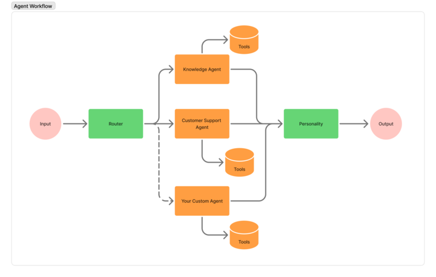

# Agent Swarm Implementation

This project implements a multi-agent system (Agent Swarm) that processes user requests through specialized agents working together. The system includes a Router Agent, Knowledge Agent with RAG capabilities, Customer Support Agent with custom tools, and a Personality Layer for human-like responses.



## Architecture Overview

The Agent Swarm consists of the following components:

1. **Router Agent**: Entry point for user messages that analyzes content and routes to specialized agents
2. **Knowledge Agent**: Handles information retrieval using RAG from InfinitePay website content
3. **Customer Support Agent**: Provides assistance for account-related issues with custom tools
4. **Personality Agent**: Transforms responses to be more human-like and engaging

The agents communicate through a well-defined workflow managed by the Router Agent, with a FastAPI endpoint exposing the functionality.

## Features

- **Message Routing**: Intelligent routing of messages to specialized agents
- **RAG Implementation**: Knowledge retrieval from InfinitePay website content
- **Custom Support Tools**: Account status and troubleshooting tools
- **Personality Layer**: Human-like response transformation
- **API Endpoint**: HTTP interface for message processing
- **Dockerization**: Containerized deployment
- **Comprehensive Testing**: Unit and end-to-end tests

## Getting Started

### Prerequisites

- Docker and Docker Compose
- OpenAI API key (for the Knowledge Agent)

### Installation and Running

1. Clone the repository
2. Set your OpenAI API key in an `.env` file:
   ```
   OPENAI_API_KEY=your_api_key_here
   ```
3. Build and run with Docker Compose:
   ```bash
   docker-compose up --build
   ```
4. The API will be available at `http://localhost:8000`

### API Usage

Send POST requests to `/api/message` with the following JSON payload:

```json
{
  "message": "Your query or statement here",
  "user_id": "some_user_identifier"
}
```

Example response:

```json
{
  "response": "The personality-infused reply or final output",
  "source_agent_response": "The original response from RAG Agent before personality was applied.",
  "agent_workflow": [{"agent_name": "agent_one", "tool_calls": {"tool_a": "tool answer"}}]
}
```

## Project Structure

```
agent_swarm/
├── src/
│   ├── agents/
│   │   ├── base_agent.py
│   │   ├── router_agent.py
│   │   ├── knowledge_agent.py
│   │   ├── customer_support_agent.py
│   │   └── personality_agent.py
│   ├── api/
│   │   └── main.py
│   ├── tests/
│   │   ├── unit/
│   │   │   ├── test_router_agent.py
│   │   │   ├── test_knowledge_agent.py
│   │   │   ├── test_customer_support_agent.py
│   │   │   └── test_personality_agent.py
│   │   └── e2e/
│   │       └── test_api.py
│   └── data/
├── Dockerfile
├── docker-compose.yml
└── requirements.txt
```

## Implementation Details

### Router Agent

The Router Agent analyzes incoming messages using pattern matching to determine the appropriate specialized agent. It manages the workflow between agents and applies the Personality Layer to responses.

### Knowledge Agent with RAG

The Knowledge Agent uses Retrieval Augmented Generation (RAG) to answer queries about InfinitePay products and services. It scrapes content from the InfinitePay website, creates a vector database, and retrieves relevant information to generate responses.

For general knowledge questions, it uses a simulated web search capability.

### Customer Support Agent

The Customer Support Agent handles account-related issues using two custom tools:

1. **Account Status Tool**: Retrieves account information and recent transactions
2. **Troubleshooting Tool**: Identifies common issues and provides solutions

The agent generates personalized support responses based on the user's account status and identified issues.

### Personality Agent

The Personality Agent transforms responses from other agents to make them more human-like and engaging. It supports multiple personality types (friendly, professional, casual) and applies various transformations like adding greetings, acknowledgments, and conversational elements.

## Testing Strategy

The testing suite includes:

1. **Unit Tests**: Individual tests for each agent, mocking dependencies to isolate functionality
2. **End-to-End Tests**: Tests for the API endpoint, covering various query types and edge cases

The tests ensure that:
- Each agent functions correctly in isolation
- The Router Agent correctly routes messages
- The Knowledge Agent retrieves and generates appropriate responses
- The Customer Support Agent correctly identifies issues and provides solutions
- The Personality Agent properly transforms responses
- The API endpoint handles requests and responses correctly

---

## Testing the Application

### 1. Run Unit and End-to-End Tests

You can run all tests using [pytest](https://docs.pytest.org/):

```bash
# From the project root directory
pip install -r requirements.txt
pip install pytest pytest-asyncio
pytest src/tests/unit
pytest src/tests/e2e
```

All tests should pass, confirming the core functionality of each agent and the API endpoint.

---

## Using the API from the Terminal

### 1. Health Check

Check if the API is running and healthy:

```bash
curl http://localhost:8000/api/health
```

Expected response:
```json
{"status": "healthy"}
```

### 2. Send a Message to the Agent Swarm

Use a POST request to `/api/message` with your query and user ID:

```bash
curl -X POST http://localhost:8000/api/message \
  -H "Content-Type: application/json" \
  -d '{"message": "What are the fees of the Maquininha Smart?", "user_id": "client789"}'
```

Example response:
```json
{
  "response": "The personality-infused reply or final output",
  "source_agent_response": "The original response from RAG Agent before personality was applied.",
  "agent_workflow": [
    {"agent_name": "Router", "tool_calls": {"message_analysis": {"message": "What are the fees of the Maquininha Smart?"}}},
    {"agent_name": "Knowledge", "tool_calls": {"rag_query": {"query": "What are the fees of the Maquininha Smart?"}}},
    {"agent_name": "Personality", "tool_calls": {"personality_transform": {"personality_type": "friendly"}}}
  ]
}
```

**Tip:**  
If your message contains single quotes, escape them or use double quotes for the outer string:
```bash
curl -X POST http://localhost:8000/api/message \
  -H "Content-Type: application/json" \
  -d "{\"message\": \"I can't sign in to my account.\", \"user_id\": \"client789\"}"
```

---

## Running with Docker

### 1. Build and Start the Application

Make sure you have Docker and Docker Compose installed.  
Set your OpenAI API key in a `.env` file in the project root:

```
OPENAI_API_KEY=your_api_key_here
```

Then build and run the service:

```bash
docker-compose up --build
```

The API will be available at [http://localhost:8000](http://localhost:8000).

### 2. Stopping the Application

To stop the service, press `CTRL+C` in the terminal running Docker Compose, or run:

```bash
docker-compose down
```

---

## Troubleshooting

- If you see `Address already in use`, stop any previous server or use a different port.
- If you get a `dquote>` prompt in the terminal, press `CTRL+C` and re-enter your curl command on a single line, ensuring all quotes and braces are closed.

---

## Docker Configuration

The project includes:
- **Dockerfile**: Builds the application image
- **docker-compose.yml**: Orchestrates the application deployment
- **requirements.txt**: Lists all Python dependencies

The Docker setup ensures the application is easily deployable and includes health checks for monitoring.

## Examples

## Customer Support Agent Example Interactions

Below are sample requests and actual replies generated by the Agent Swarm, demonstrating account troubleshooting, knowledge responses, and the effect of the Personality Layer.

---

### Example 1: Account Login Issue

**Request**

```json
{
  "message": "I can't sign in to my account.",
  "user_id": "client789"
}
```

**Response**

```json
{
  "response": "I see, greetings! I understand you're having an issue with login issues! Here are some steps that might help:\n\n1. Reset your password through the 'Forgot Password' link on the login page\n2. Ensure you're using the correct email address associated with your account\n3. Check if Caps Lock is enabled when typing your password\n4. Clear your browser cache and cookies, then try again\n5. Try using a different browser or device\n6. Ensure your account hasn't been locked due to multiple failed login attempts\n\nIf you've tried these steps and still can't log in, please contact our support team with your account email for further assistance. Happy to assist further!",
  "source_agent_response": "I understand you're having an issue with login issues. Here are some steps that might help:\n\n1. Reset your password through the 'Forgot Password' link on the login page\n2. Ensure you're using the correct email address associated with your account\n3. Check if Caps Lock is enabled when typing your password\n4. Clear your browser cache and cookies, then try again\n5. Try using a different browser or device\n6. Ensure your account hasn't been locked due to multiple failed login attempts\n\nIf you've tried these steps and still can't log in, please contact our support team with your account email for further assistance.",
  "agent_workflow": [
    {"agent_name": "Router", "tool_calls": {"message_analysis": {"message": "I can't sign in to my account."}}},
    {"agent_name": "Customer Support", "tool_calls": {
      "troubleshooting": {
        "issue_type": "login_issues",
        "title": "Login Issues",
        "solutions": [
          "Reset your password through the 'Forgot Password' link on the login page",
          "Ensure you're using the correct email address associated with your account",
          "Check if Caps Lock is enabled when typing your password",
          "Clear your browser cache and cookies, then try again",
          "Try using a different browser or device",
          "Ensure your account hasn't been locked due to multiple failed login attempts"
        ],
        "escalation": "If you've tried these steps and still can't log in, please contact our support team with your account email for further assistance."
      },
      "account_status": {"user_id": "client789", "status": "active"}
    }},
    {"agent_name": "Personality", "tool_calls": {"personality_transform": {"personality_type": "friendly","original_length":617,"transformed_length":660}}}
  ]
}
```

---

### Example 2: Transfer Not Working

**Request**

```json
{
  "message": "Why I am not able to make transfers?",
  "user_id": "client789"
}
```

**Response**

```json
{
  "response": "I see, greetings! You may not be able to make transfers for various reasons, such as insufficient funds in your account, technical issues with the platform, or restrictions imposed by the financial services company. I recommend contacting customer support for InfinitePay to get more information on why you are unable to make transfers. Happy to assist further! 👍",
  "source_agent_response": "You may not be able to make transfers for various reasons, such as insufficient funds in your account, technical issues with the platform, or restrictions imposed by the financial services company. I recommend contacting customer support for InfinitePay to get more information on why you are unable to make transfers.",
  "agent_workflow": [
    {"agent_name":"Router","tool_calls":{"message_analysis":{"message":"Why I am not able to make transfers?"}}},
    {"agent_name":"Knowledge","tool_calls":{
      "initialize_rag":{"status":"completed"},
      "web_scraping":{"url":"https://www.infinitepay.io/rendimento","status":"success"},
      "rag_query":{"query":"Why I am not able to make transfers?"}
    }},
    {"agent_name":"Personality","tool_calls":{"personality_transform":{"personality_type":"friendly","original_length":318,"transformed_length":363}}}
  ]
}
```

---

### Example 3: Unsupported Domain (Palmeiras Game)

**Request**

```json
{
  "message": "Quando foi o último jogo do Palmeiras?",
  "user_id": "client789"
}
```

**Response**

```json
{
  "response": "I understand, greetings! Desculpe, eu não sei a resposta a essa pergunta. Let me know if you need anything else!",
  "source_agent_response": "Desculpe, eu não sei a resposta a essa pergunta.",
  "agent_workflow": [
    {"agent_name":"Router","tool_calls":{"message_analysis":{"message":"Quando foi o último jogo do Palmeiras?"}}},
    {"agent_name":"Knowledge","tool_calls":{
      "initialize_rag":{"status":"completed"},
      "web_scraping":{"url":"https://www.infinitepay.io/rendimento","status":"success"},
      "rag_query":{"query":"Quando foi o último jogo do Palmeiras?"}
    }},
    {"agent_name":"Personality","tool_calls":{"personality_transform":{"personality_type":"friendly","original_length":48,"transformed_length":112}}}
  ]
}
```

---

### Example 4: Unsupported Domain (São Paulo News)

**Request**

```json
{
  "message": "Quais as principais notícias de São Paulo hoje?",
  "user_id": "client789"
}
```

**Response**

```json
{
  "response": "I understand, hi basically there! Desculpe, não tenho informações sobre as principais notícias de São Paulo hoje! Let me know if you need anything else!",
  "source_agent_response": "Desculpe, não tenho informações sobre as principais notícias de São Paulo hoje.",
  "agent_workflow": [
    {"agent_name":"Router","tool_calls":{"message_analysis":{"message":"Quais as principais notícias de São Paulo hoje?"}}},
    {"agent_name":"Knowledge","tool_calls":{
      "initialize_rag":{"status":"completed"},
      "web_scraping":{"url":"https://www.infinitepay.io/rendimento","status":"success"},
      "rag_query":{"query":"Quais as principais notícias de São Paulo hoje?"}
    }},
    {"agent_name":"Personality","tool_calls":{"personality_transform":{"personality_type":"friendly","original_length":79,"transformed_length":152}}}
  ]
}
```

---

### Example 5: Fee Structure Inquiry

**Request**

```json
{
  "message": "What are the fees of the Maquininha Smart",
  "user_id": "client789"
}
```

**Response**

```json
{
  "response": "I see, hello! The fees for the Maquininha Smart from InfinitePay are as follows:\n- Pix: 0%\n- Debit: 0.35%\n- Credit in 1x: 2.69%\n- Credit in 3x: 4.46%\n- Credit in 6x: 5.99%\n- Credit in 12x: 8.99% I'm here if you have more questions! 🙌",
  "source_agent_response": "The fees for the Maquininha Smart from InfinitePay are as follows:\n- Pix: 0%\n- Debit: 0.35%\n- Credit in 1x: 2.69%\n- Credit in 3x: 4.46%\n- Credit in 6x: 5.99%\n- Credit in 12x: 8.99%",
  "agent_workflow": [
    {"agent_name":"Router","tool_calls":{"message_analysis":{"message":"What are the fees of the Maquininha Smart"}}},
    {"agent_name":"Knowledge","tool_calls":{
      "initialize_rag":{"status":"completed"},
      "web_scraping":{"url":"https://www.infinitepay.io/rendimento","status":"success"},
      "rag_query":{"query":"What are the fees of the Maquininha Smart"}
    }},
    {"agent_name":"Personality","tool_calls":{"personality_transform":{"personality_type":"friendly","original_length":180,"transformed_length":233}}}
  ]
}
```

---

### Example 6: Maquininha Cost Breakdown

**Request**

```json
{
  "message": "What is the cost of the Maquininha Smart?",
  "user_id": "client789"
}
```

**Response**

```json
{
  "response": "I see, hey! The cost of the Maquininha Smart from InfinitePay is 12 installments of R$16.58! Happy to assist further!",
  "source_agent_response": "The cost of the Maquininha Smart from InfinitePay is 12 installments of R$16.58.",
  "agent_workflow": [
    {"agent_name":"Router","tool_calls":{"message_analysis":{"message":"What is the cost of the Maquininha Smart?"}}},
    {"agent_name":"Knowledge","tool_calls":{
      "initialize_rag":{"status":"completed"},
      "web_scraping":{"url":"https://www.infinitepay.io/rendimento","status":"success"},
      "rag_query":{"query":"What is the cost of the Maquininha Smart?"}
    }},
    {"agent_name":"Personality","tool_calls":{"personality_transform":{"personality_type":"friendly","original_length":80,"transformed_length":117}}}
  ]
}
```

---

### Example 7: Card Transaction Rate Inquiry

**Request**

```json
{
  "message": "What are the rates for debit and credit card transactions?",
  "user_id": "client789"
}
```

**Response**

```json
{
  "response": "I see, greetings! The rates for debit card transactions range from 0.75% to 2.29%, depending on the monthly revenue. For credit card transactions, the rates range from 2.69% to 5.49%. Hope that helps! 👍",
  "source_agent_response": "The rates for debit card transactions range from 0.75% to 2.29%, depending on the monthly revenue. For credit card transactions, the rates range from 2.69% to 5.49%.",
  "agent_workflow": [
    {"agent_name":"Router","tool_calls":{"message_analysis":{"message":"What are the rates for debit and credit card transactions?"}}},
    {"agent_name":"Knowledge","tool_calls":{
      "initialize_rag":{"status":"completed"},
      "web_scraping":{"url":"https://www.infinitepay.io/rendimento","status":"success"},
      "rag_query":{"query":"What are the rates for debit and credit card transactions?"}
    }},
    {"agent_name":"Personality","tool_calls":{"personality_transform":{"personality_type":"friendly","original_length":165,"transformed_length":202}}}
  ]
}
```

---

### Example 8: Use Phone as Card Machine

**Request**

```json
{
  "message": "How can I use my phone as a card machine?",
  "user_id": "client789"
}
```

**Response**

```json
{
  "response": "I understand, hi there! You can use your phone as a card machine by downloading the InfinitePay app and using the \"InfiniteTap\" function for Android or \"Tap to Pay no iPhone\" for iOS! Then, you can enter the sale amount, select the product from the catalog, and click on \"Charge.\" Ask your customer to approach their card, phone, or smartwatch to complete the transaction! If the purchase is over R$ 200, they will need to enter their PIN! The sale will be completed in seconds! Happy to assist further!",
  "source_agent_response": "You can use your phone as a card machine by downloading the InfinitePay app and using the \"InfiniteTap\" function for Android or \"Tap to Pay no iPhone\" for iOS. Then, you can enter the sale amount, select the product from the catalog, and click on \"Charge.\" Ask your customer to approach their card, phone, or smartwatch to complete the transaction. If the purchase is over R$ 200, they will need to enter their PIN. The sale will be completed in seconds.",
  "agent_workflow": [
    {"agent_name":"Router","tool_calls":{"message_analysis":{"message":"How can I use my phone as a card machine?"}}},
    {"agent_name":"Knowledge","tool_calls":{
      "initialize_rag":{"status":"completed"},
      "web_scraping":{"url":"https://www.infinitepay.io/rendimento","status":"success"},
      "rag_query":{"query":"How can I use my phone as a card machine?"}
    }},
    {"agent_name":"Personality","tool_calls":{"personality_transform":{"personality_type":"friendly","original_length":454,"transformed_length":503}}}
  ]
}
```

---


## Future Enhancements

Potential enhancements for the system include:

1. **Additional Agents**: Implementing specialized agents for specific tasks
2. **Guardrails**: Adding mechanisms to handle undesired questions/responses
3. **Human Redirection**: Implementing a system to redirect complex queries to human operators
4. **Improved RAG**: Enhancing the knowledge retrieval with more sophisticated techniques
5. **Persistent Storage**: Adding database integration for user data and conversation history

## License

This project is licensed under the MIT License - see the LICENSE file for details.
